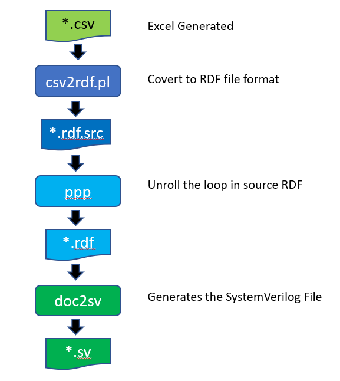

# CSV2SV
Generate Simple Register Access RTL File from Excel output CSV File

please install libreoffice to generates csv file first

Example Script(Bash):
>proj_reg=apb_gpio_reg
>libreoffice --headless --convert-to csv --outdir ../src ../doc/$proj_reg.xlsx

>\# fix "'" character missing issue in generated csv file

>cat ../src/$proj_reg.csv | tr "\222" "\047" > ../src/$proj_reg.hack.csv

>csv2sv ../src/$proj_reg.hack.csv

>mv $proj_reg.rtl $proj_reg.sv

